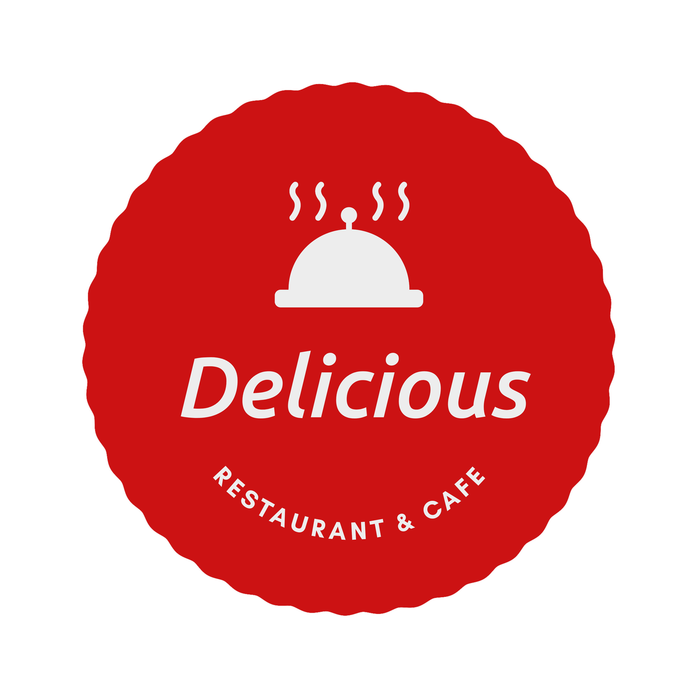

# 🍽️ Cold Delicacies Restaurant Website

Welcome to the official repository for a modern and elegant restaurant website specializing in **cold delicacies**—from refreshing salads and sushi rolls to artisanal gelato and chilled seafood platters.

## 🌟 Overview

This web application offers a seamless experience for customers to explore the menu, place orders, and learn more about the restaurant's story and offerings.

## 🔧 Features

- 🧊 **Cold Delicacy Menu**  
  Categorized menu showcasing chilled appetizers, mains, and desserts.

- 📸 **Gallery**  
  High-resolution images of signature dishes to tempt every visitor.

- 🛒 **Online Ordering**  
  Smooth cart and checkout system for takeout or delivery.

- 📍 **Location & Hours**  
  Interactive map and business hours for easy planning.

- 📞 **Contact & Reservations**  
  Quick access to booking and customer support.

## 💻 Tech Stack

- **Frontend**: HTML, CSS, JavaScript, Next.js


## 🚀 Getting Started

1. Clone the repository:
   ```bash
   git clone https://github.com/OmarYasirR/delicacies.git
